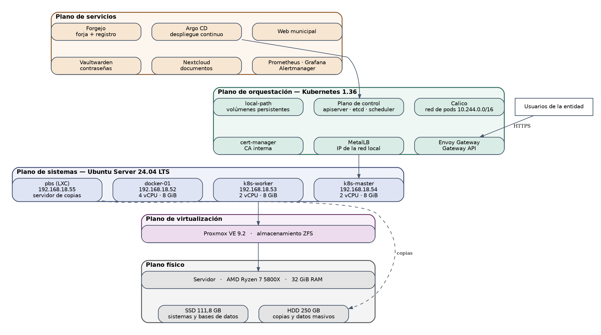
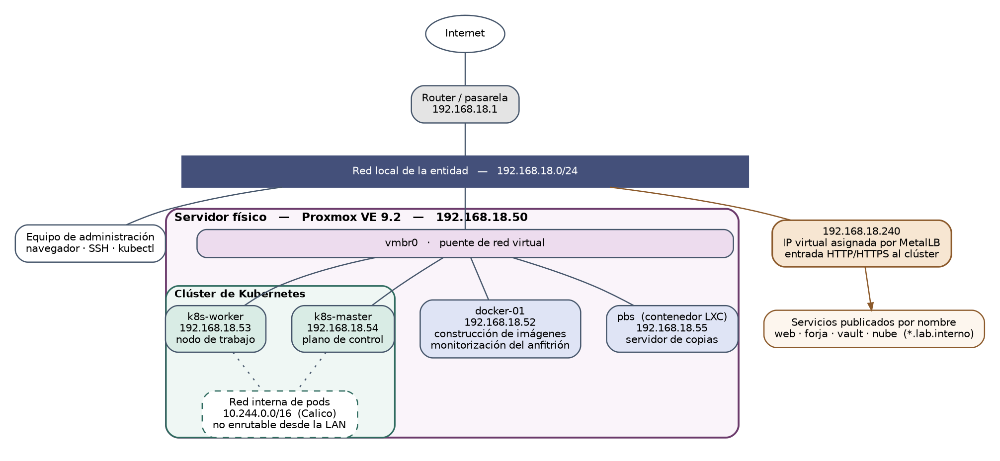

# Plataforma DevOps autoalojada para los servicios internos de una entidad local

Proyecto Intermodular del Ciclo Formativo de Grado Superior en Administración de
Sistemas Informáticos en Red. Curso 2026-2027.

**Autor:** Alberto Mira ([@Xhinen](https://github.com/Xhinen))

---

## Qué es esto

La infraestructura completa que necesitaría el departamento de informática de un
ayuntamiento pequeño para alojar sus propios servicios, construida íntegramente
con software libre y sin depender de proveedores externos: una forja de código
con integración continua, un gestor de contraseñas corporativo, almacenamiento
de documentos compartido y el sitio web institucional.

El caso de uso es una entidad ficticia, el **Ayuntamiento de Sierra Alta**, con
unos veinte empleados y dos técnicos de informática.

El objetivo del proyecto no es instalar cuatro aplicaciones, sino construir la
plataforma que las sostiene y el proceso que permite mantenerlas y actualizarlas
sin sobresaltos. Por eso este repositorio importa: **todo lo que define la
plataforma está aquí como código**, de modo que la infraestructura pueda
reconstruirse desde cero sin conocimiento tácito de por medio.

## Arquitectura



Cuatro planos superpuestos, cada uno apoyado en el anterior:

| Plano | Función | Tecnología |
|---|---|---|
| Virtualización | Máquinas virtuales y contenedores de sistema | Proxmox VE 9.2 |
| Sistemas | Base de los nodos, endurecida y reproducible | Ubuntu Server 24.04 LTS, **Ansible** |
| Orquestación | Alta disponibilidad y gestión de cargas | Kubernetes (kubeadm), Calico, MetalLB |
| Entrada y certificados | Acceso por dominio con HTTPS | Gateway API, Envoy Gateway, cert-manager |
| Servicios | Las aplicaciones que usa la entidad | Forgejo, Vaultwarden, Nextcloud, web municipal |
| Entrega de software | Del commit a producción sin intervención manual | Forgejo Actions, Trivy, Argo CD |
| Observabilidad | Métricas, paneles y alertas | Prometheus, Grafana, Alertmanager |
| Continuidad | Copias de seguridad y recuperación verificada | Proxmox Backup Server |

Ansible se sitúa **por debajo** de Kubernetes, no por encima: configura el
sistema operativo de las máquinas sobre el que después se instala el clúster.

### Topología de red



| Máquina | Dirección | Recursos | Función |
|---|---|---|---|
| `proxmox` | 192.168.18.50 | AMD Ryzen 7 5800X / 32 GiB | Hipervisor |
| `docker-01` | 192.168.18.52 | 4 vCPU / 8 GiB | Motor de contenedores, construcción de imágenes, monitorización del anfitrión |
| `k8s-master` | 192.168.18.54 | 2 vCPU / 8 GiB | Plano de control del clúster |
| `k8s-worker` | 192.168.18.53 | 2 vCPU / 8 GiB | Nodo de trabajo |
| `pbs` (LXC) | 192.168.18.55 | 1 GiB | Servidor de copias de seguridad |

Rango reservado para el balanceador de carga: 192.168.18.240 en adelante.
Red interna de pods: 10.244.0.0/16, no enrutable fuera del clúster.

## Organización del repositorio

```
ansible/          Configuración declarativa de los nodos (la piedra angular)
  inventario/     Inventario de máquinas por entorno
  group_vars/     Variables por grupo de máquinas
  playbooks/      Puntos de entrada: endurecimiento, alta de nodo, clúster
  roles/          Roles reutilizables
kubernetes/
  base/           Componentes de plataforma: red, balanceo, entrada, certificados
  aplicaciones/   Manifiestos de los servicios del caso de uso
scripts/          Utilidades de diagnóstico e inventario
docs/
  cuaderno/       Cuaderno de laboratorio: procedimientos paso a paso por fase
  diagramas/      Fuentes y exportaciones de los diagramas de la memoria
evidencias/       Salidas de verificación con fecha, por fase
```

## Reproducir la plataforma

> Pendiente de completar conforme avancen las fases de automatización.
> El objetivo declarado del proyecto es que dar de alta un nodo nuevo se reduzca
> a añadirlo al inventario y ejecutar un playbook.

```bash
# Inventario del estado actual de la infraestructura
./scripts/inventario.sh

# Configuración de un nodo nuevo (en construcción)
# ansible-playbook -i ansible/inventario/produccion.ini ansible/playbooks/nodo-kubernetes.yml
```

## Estado del proyecto

| Fase | Estado |
|---|---|
| 1-2 · Infraestructura base y contenedores | Completado y verificado |
| 3 · Observabilidad sobre contenedores | Completado y verificado |
| 4 · Entorno de aprendizaje | Completado y verificado |
| 5 · Clúster de producción | Completado y verificado |
| 6 · Observabilidad del clúster | Completado y verificado |
| 7 · Publicación de la aplicación | Completado y verificado |
| 8 · Endurecimiento y copias de seguridad | Completado y verificado |
| 9 · Ampliación de almacenamiento y recuperación de copias | Completado y verificado |
| 10 · Automatización con Ansible y alta de nodo | En curso |
| 11 · DNS interno y certificados propios | Pendiente |
| 12 · Forja de código con base de datos | Pendiente |
| 13 · Integración y despliegue continuos | Pendiente |
| 14 · Gestor de contraseñas y almacenamiento de documentos | Pendiente |
| 15 · Copias de datos y prueba de recuperación | Pendiente |

Defensa prevista: semana del 14 al 20 de diciembre de 2026.

## Seguridad

Este repositorio **no contiene secretos**. Las claves privadas, los ficheros
`kubeconfig`, las contraseñas de Ansible Vault y los *secrets* de Kubernetes
están excluidos en `.gitignore` y, en el caso de los secretos del clúster, se
gestionan cifrados mediante Sealed Secrets.

Las direcciones IP que aparecen corresponden a una red de laboratorio privada
sin exposición a Internet.

## Licencia

Código bajo licencia GPL-3.0. Documentación bajo CC BY-SA 4.0.
